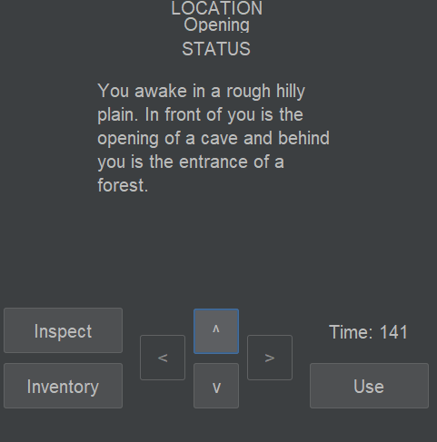
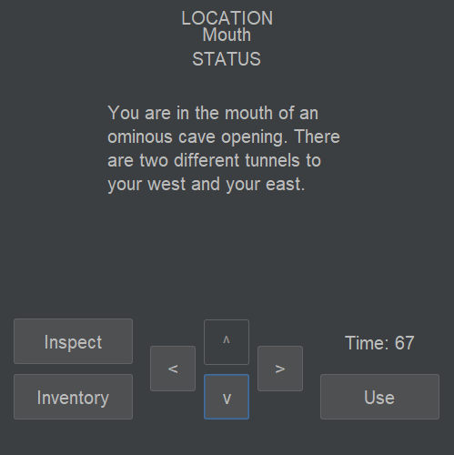
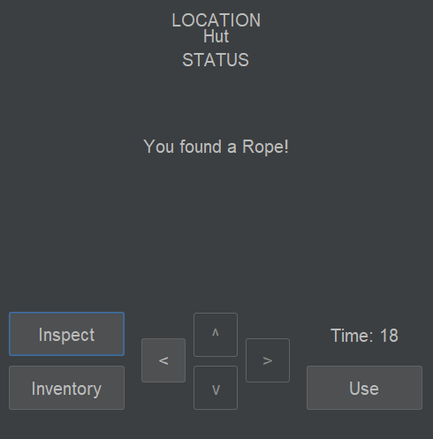
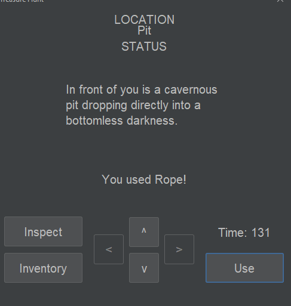

# Test Plan and Evidence / Results of Testing

## Game Description

The project involves the programming of a game.

The game is a puzzle adventure game where the player must venture into a cave and then escape with the treasure.

### Game Features and Rules

The game has the following features and/or rules:

- Moving around the map with up/down/left/right buttons
- Collecting items placed at certain locations
- Using items to unlock new locations
- A timer that loses the game when it runs out

---

## Test Plan

The following game features / functionality and player actions will need to be tested:

- Moving to a different location
- Collecting an item
- Using an item
- Completing the game
- Running out of time

The following tests will be run against the completed game. The tests should result in the expected outcomes shown.

### Moving to a different location

To test this I will need to press the buttons to move to a different location

#### Test Data / Actions to Use

The test data I will use is moving north into the cave entrance from the start location using the north button.

#### Expected Outcome

The expected outcome is that the player will be able to move to valid locations, if a location is blocked then the game
should have a message telling them that its blocked, and if there's no valid location there the button should be greyed out.

### Collecting an item

To test this I will need to press the inspect button in a location with an item in it

#### Test Data / Actions to Use

To test this I will be picking up the rope item in the hut location using the inspect button.

#### Expected Outcome

The expected outcome is that the item will disappear from the location and will now be in the players inventory. If there was
no item in the location then the expected result is that the game would give a message saying so.

### Using an item

To test this I will need to use an item in a location that needs that item to be used.

#### Test Data / Actions to Use

To test this I will be using the rope item in the pit location to traverse the pit using the use button.

#### Expected Outcome

The expected outcome is that this will allow the player to bypass the barrier (pit) and access the next area. If this wasn't a valid location for an item to be used, the expected outcome is that the game would give a message explaining this.

### Completing the Game

To test this I will need to complete the game.

#### Test Data / Actions to Use

I will be walking through the exit of the game with the treasure item collected.

#### Expected Outcome

The expected outcome is that the game will show a completion message upon walking through the exit with the treasure. If the treasure hadn't been obtained, there should be a message to the player explaining this.

---

## Evidence / Results of Testing

### Moving to a different location

1. Pressing north button

2. Moving to cave mouth location

These are the expected results.

### Collecting an item

When pressing the inspect button in the hut, the rope is given to the player as expected.

### Using an item

Upon pressing "use" in the pit, the player can now press north and move to the next location.

### Completing the game

Upon walking through the exit with the treasure, the game completion screen comes up as expected.

### Running out of time

When the timer hits 0, the game switches to the game over screen as expected.